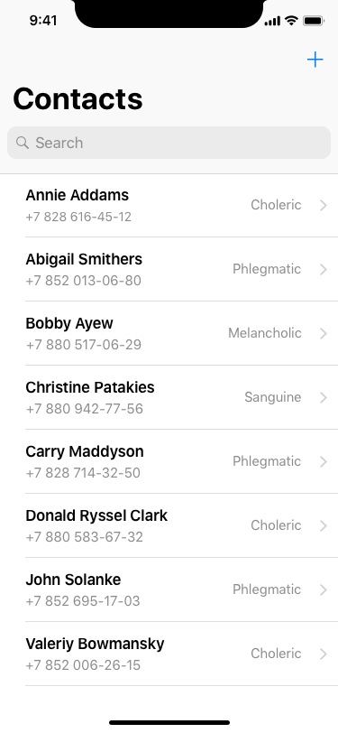
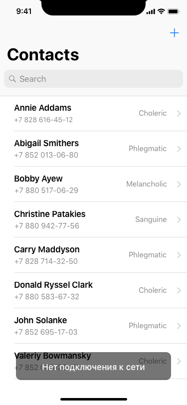

# Задача
Написать мобильное приложение, которое отображет список контактов и выполняет поиск по ним.
 - Приложение должно быть написано на Swift.
 - В качестве локального хранилища использовать Realm.
 - Было бы не плохо использовать RxSwift. 
 - Решенное задание выложить на github/gitlab, код в архиве приниматься не будет.

# Описание
Приложение получает данные из трех источников: [источник1](json/generated-01.json), [источник2](json/generated-02.json), [источник3](json/generated-03.json) и сохраняет их локально. Для получения прямой ссылки на json нажать View Raw при просмотре.

Контакт человека имеет следующий вид
- id (string) — ID контакта
- name (string) — Имя человека
- height (float) — Рост человека
- biography (string) — Биография человека
- temperament (enum) — Темперамент человека (melancholic, phlegmatic, sanguine, choleric)
- educationPeriod (object) — Период прохождения учебы. Состоит из дат start и end.

Если при запуске приложения с момента прошлой загрузки данных прошло более 1 минуты, то данные необходимо загрузить заново, иначе, нужно показать данные, сохраненные локально.

Список контактов можно обновить свайпом вниз. Если при загрузке или обновлении данных происходит ошибка, то нужно показать ее как на скриншоте:

Поиск среди контактов происходит по имени или номеру телефона. Результаты поиска появляются по мере ввода символов в строку поиска и могут отображаться в основном списке. При клике на контакт открывается экран с более подробной информацией. Клик по номеру телефона инициалтзирует вызов.

